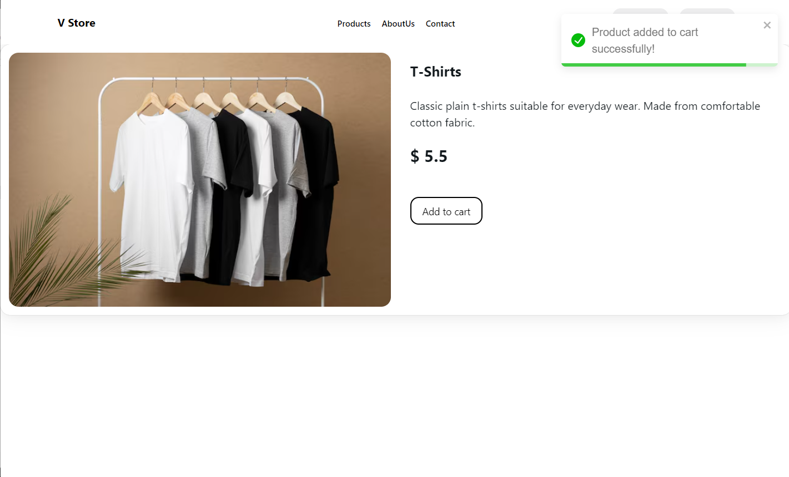

# E-Commerce

###  Simple ecommerce cart application built with Typescript, Next JS and Mongo DB.





#### This is a Next.js project bootstrapped with create-next-app.

### Getting Started
##### First, run the development server:

```bash
npm run dev
```

##### Open http://localhost:3000 with your browser to see the result.